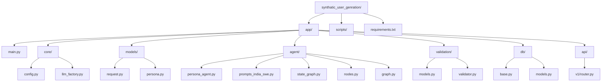
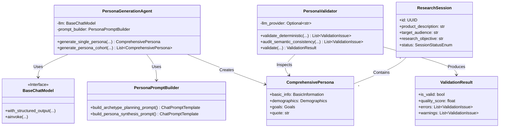
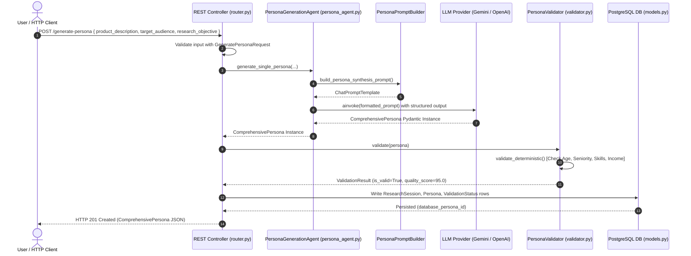
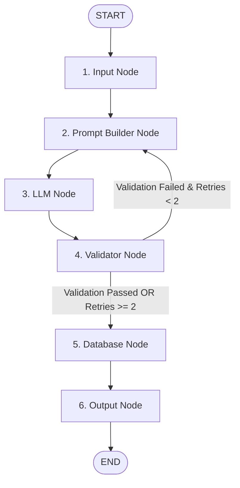

# Master Technical Textbook & Codebase Documentation
## Synthetic User Research Platform — Persona Generation Agent

**Role**: Senior AI Architect, Senior Python Developer & Technical Documentation Engineer  
**Target Level**: Fresher to Advanced Engineers  
**Document Version**: 2.0.0 (Master Edition)  
**Repository**: `c:\Users\gadde\OneDrive\Desktop\synthatic_user_genration`  

---

## Table of Contents
1. [System Architecture & UML Diagrams](#1-system-architecture--uml-diagrams)
2. [Chapter 1: Root & Core Infrastructure (`app/core/`)](#chapter-1-root--core-infrastructure-appcore)
3. [Chapter 2: Domain Schemas & Data Contracts (`app/models/`)](#chapter-2-domain-schemas--data-contracts-appmodels)
4. [Chapter 3: AI Agents, Prompts & LangGraph Engine (`app/agent/`)](#chapter-3-ai-agents-prompts--langgraph-engine-appagent)
5. [Chapter 4: Quality & Validation Subsystem (`app/validation/`)](#chapter-4-quality--validation-subsystem-appvalidation)
6. [Chapter 5: PostgreSQL Database Persistence Layer (`app/db/`)](#chapter-5-postgresql-database-persistence-layer-appdb)
7. [Chapter 6: REST API Controller Layer (`app/api/`)](#chapter-6-rest-api-controller-layer-appapi)
8. [Chapter 7: Runnable Scripts & Benchmark Suite (`scripts/`)](#chapter-7-runnable-scripts--benchmark-suite-scripts)
9. [Subsystem Deep Dives](#subsystem-deep-dives)
10. [End-to-End Life Cycle Execution Walkthrough](#end-to-end-life-cycle-execution-walkthrough)

---

## 1. System Architecture & UML Diagrams

### 1.1. Folder Hierarchy UML Diagram


---

### 1.2. System Class Diagram


---

### 1.3. Sequence Diagram


---

### 1.4. Workflow Diagram (LangGraph Execution)


---

## Chapter 1: Root & Core Infrastructure (`app/core/`)

### Folder Architectural Analysis
- **Responsibility**: Manages global application state, configuration loading, and LLM vendor client factories.
- **Why It Exists**: Decouples application business logic from environment variables and specific LLM SDK vendor lock-in.
- **Design Pattern**: **Factory Method Pattern** & **Singleton Pattern**.
- **Interaction**: Consumed by `app/agent/`, `app/validation/`, and `app/api/`.

---

### Section 1.1: `app/main.py`
- **Purpose**: ASGI application composition root. Initializes FastAPI, registers CORS middleware, and mounts API controllers.
- **Source Code Explanation**:
  ```python
  from fastapi import FastAPI
  from fastapi.middleware.cors import CORSMiddleware
  from app.core.config import settings
  from app.api.v1.router import router as api_v1_router

  app = FastAPI(
      title=settings.PROJECT_NAME,
      description="AI-Powered Synthetic User Research Platform API",
      version="1.0.0",
      docs_url="/docs",
      redoc_url="/redoc"
  )

  app.add_middleware(
      CORSMiddleware,
      allow_origins=["*"],
      allow_credentials=True,
      allow_methods=["*"],
      allow_headers=["*"],
  )

  app.include_router(api_v1_router)
  app.include_router(api_v1_router, prefix=settings.API_V1_STR)

  @app.get("/health", tags=["Health Check"])
  async def health_check():
      return {"status": "online", "platform": settings.PROJECT_NAME}
  ```
- **Every Class & Function**:
  - `health_check()`:
    - *Input*: None.
    - *Output*: Dict `{"status": "online", "platform": "..."}`.
    - *Complexity*: Time $O(1)$, Space $O(1)$.
    - *Real-world usage*: Kubernetes Liveness / Readiness probes.
- **SOLID Principles**: **Single Responsibility Principle (SRP)** — focuses exclusively on web server configuration.
- **Why Chosen**: Standard, high-performance ASGI application setup for Python.

---

### Section 1.2: `app/core/config.py`
- **Purpose**: Parses `.env` variables into type-safe Python attributes using Pydantic Settings.
- **Classes**:
  - `Settings(BaseSettings)`: Holds configuration parameters (`GOOGLE_API_KEY`, `OPENAI_API_KEY`, default models).
- **SOLID Principles**: **Single Responsibility Principle (SRP)** — strictly handles settings management.

---

### Section 1.3: `app/core/llm_factory.py`
- **Purpose**: Instantiates LangChain Chat Models (`ChatGoogleGenerativeAI` or `ChatOpenAI`).
- **Functions**:
  - `get_llm(provider: str = "gemini", model_name: Optional[str] = None) -> BaseChatModel`:
    - *Input*: `provider` (`"gemini"` or `"openai"`), `model_name` (optional).
    - *Output*: `BaseChatModel` interface.
    - *Internal Logic*: Evaluates provider string, fetches API keys from settings, returns instantiated model.
    - *Complexity*: Time $O(1)$, Space $O(1)$.
- **SOLID Principles**: **Dependency Inversion Principle (DIP)** — high-level agents depend on the abstract `BaseChatModel` interface rather than concrete provider implementations.

---

## Chapter 2: Domain Schemas & Data Contracts (`app/models/`)

### Folder Architectural Analysis
- **Responsibility**: Defines all input/output data transfer objects (DTOs) and domain schemas.
- **Design Pattern**: **Data Transfer Object (DTO) Pattern** & **Type-Safe Contract Pattern**.

---

### Section 2.1: `app/models/request.py`
- **Classes**:
  - `GeneratePersonaRequest(BaseModel)`: Input DTO for API.
  - `PersonaGenerationResponse(BaseModel)`: Output DTO wrapper for API responses.

---

### Section 2.2: `app/models/persona.py`
- **Classes**:
  - `BasicInformation`, `Demographics`, `Education`, `Occupation`, `Goals`, `Motivations`, `Challenges`, `Behaviour`, `PersonalityTraits`, `TechnicalSkills`, `TechnologyUsage`, `ComprehensivePersona`.
- **Why Chosen**: Pydantic V2 models provide runtime type enforcement, JSON schema generation, and direct binding to LLM outputs.

---

## Chapter 3: AI Agents, Prompts & LangGraph Engine (`app/agent/`)

### Folder Architectural Analysis
- **Responsibility**: Houses LLM prompts, OOP Agent wrappers, and LangGraph workflow state machines.
- **Design Pattern**: **State Machine Pattern**, **Builder Pattern**, and **Dependency Injection**.

---

### Section 3.1: `app/agent/persona_agent.py`
- **Classes**:
  - `PersonaPromptBuilder`: Constructs template strings for archetypes and persona synthesis.
  - `PersonaGenerationAgent`:
    - `generate_single_persona()`:
      - *Input*: `product_description`, `target_audience`, `research_objective`, archetype parameters.
      - *Output*: `ComprehensivePersona` Pydantic instance.
      - *Internal Logic*: Formats prompt via `PersonaPromptBuilder`, binds structured output via `llm.with_structured_output(ComprehensivePersona)`, invokes model chain, and returns validated persona object.
      - *Complexity*: Time $O(\text{LLM Latency})$, Space $O(\text{Response Tokens})$.

---

### Section 3.2: `app/agent/state_graph.py`
- **State Definition**: `PersonaWorkflowState(TypedDict)`
- **Nodes**:
  - `input_node()`: Assigns session UUID and initializes state defaults.
  - `prompt_builder_node()`: Formats prompts and appends error feedback during retries.
  - `llm_node()`: Invokes structured LLM binding.
  - `validator_node()`: Runs persona validation checks.
  - `database_node()`: Persists records to PostgreSQL.
  - `output_node()`: Formats API response envelope.
- **Router Function**:
  - `should_retry_or_persist(state) -> str`: If validation fails and retries remain, returns `"Prompt Builder"` (retry loop); otherwise returns `"Database"`.

---

## Chapter 4: Quality & Validation Subsystem (`app/validation/`)

### Folder Architectural Analysis
- **Responsibility**: Guarantees synthetic personas are realistic, free of age/seniority mismatches, and free of narrative self-contradictions.
- **Design Pattern**: **Rule Engine Pattern** & **Strategy Pattern**.

---

### Section 4.1: `app/validation/validator.py`
- **Classes**:
  - `PersonaValidator`:
    - `validate_deterministic(persona: ComprehensivePersona) -> List[ValidationIssue]`: Checks required non-empty fields, age vs job title seniority (e.g. age < 18 or < 24 holding VP/Director titles), skills vs education, and income sanity bounds.
    - `audit_semantic_consistency(persona: ComprehensivePersona) -> List[ValidationIssue]`: Calls LLM to inspect narrative cross-field self-contradictions.
    - `validate(persona: ComprehensivePersona) -> ValidationResult`: Runs both validation suites, calculates quality score ($100 - \text{penalties}$), and returns `ValidationResult`.

---

## Chapter 5: PostgreSQL Database Persistence Layer (`app/db/`)

### Folder Architectural Analysis
- **Responsibility**: Maps application objects to relational database tables with foreign keys, indexes, and `JSONB` columns.
- **Design Pattern**: **Data Mapper ORM Pattern** (SQLAlchemy 2.0).

---

### Section 5.1: `app/db/models.py`
- **Classes**:
  - `ResearchSession`: Stores session parameters and status enum.
  - `Persona`: Stores core indexed fields + full payload in `full_persona_json` (`JSONB`).
  - `ValidationStatus`: Stores validation error logs and quality scores (`JSONB`).
  - `GeneratedResponse`: Stores synthetic interview responses and sentiment metrics.

---

## Chapter 6: REST API Controller Layer (`app/api/`)

### Section 6.1: `app/api/v1/router.py`
- **Functions**:
  - `generate_persona_endpoint(payload, agent, validator) -> ComprehensivePersona`: Route handler for `POST /generate-persona`. Invokes generation, runs validation, raises HTTP 422 if validation fails, and returns `201 Created`.

---

## Chapter 7: Runnable Scripts & Benchmark Suite (`scripts/`)

- `scripts/generate_india_swe_personas.py`: specialized prompt runner.
- `scripts/run_persona_agent_demo.py`: OOP agent demo test script.
- `scripts/test_persona_validator.py`: validation rules test runner.

---

## Subsystem Deep Dives

### Prompt Engineering Strategy
To avoid generic caricatures among **aspiring software engineers in India**, prompts explicitly require:
1. **College Tiers**: Tier-1 (IITs/NITs/BITS), Tier-2 (State Universities), Tier-3 (Affiliated regional colleges), and Non-CS bootcamp switchers.
2. **Infrastructure Realism**: Maps laptop specs, internet connectivity (5G hotspot vs fiber), and learning budgets in INR to economic backgrounds.
3. **Structured Binding**: Binds Pydantic schemas directly to LLMs via Function Calling to ensure 100% JSON validity.

---

## End-to-End Life Cycle Execution Walkthrough

```text
1. User Request (POST /generate-persona)
   ↓
2. Pydantic Ingress Validation (GeneratePersonaRequest)
   ↓
3. LangGraph Workflow Execution (Input Node -> Assigns Session UUID)
   ↓
4. Prompt Builder Node (Interpolates prompt variables + feedback)
   ↓
5. LLM Node (Gemini/OpenAI invokes with_structured_output(ComprehensivePersona))
   ↓
6. Validator Node (Runs Age/Seniority, Skills/Education, Income bounds & Semantic audit)
   └─> If Validation Fails & Retries < 2: Loops back to Prompt Builder with feedback!
   └─> If Validation Passes OR Retries Exhausted: Moves to Database Node.
   ↓
7. Database Node (Persists ResearchSession, Persona, and ValidationStatus to PostgreSQL)
   ↓
8. Output Node (Returns HTTP 201 Created with structured persona JSON)
```
