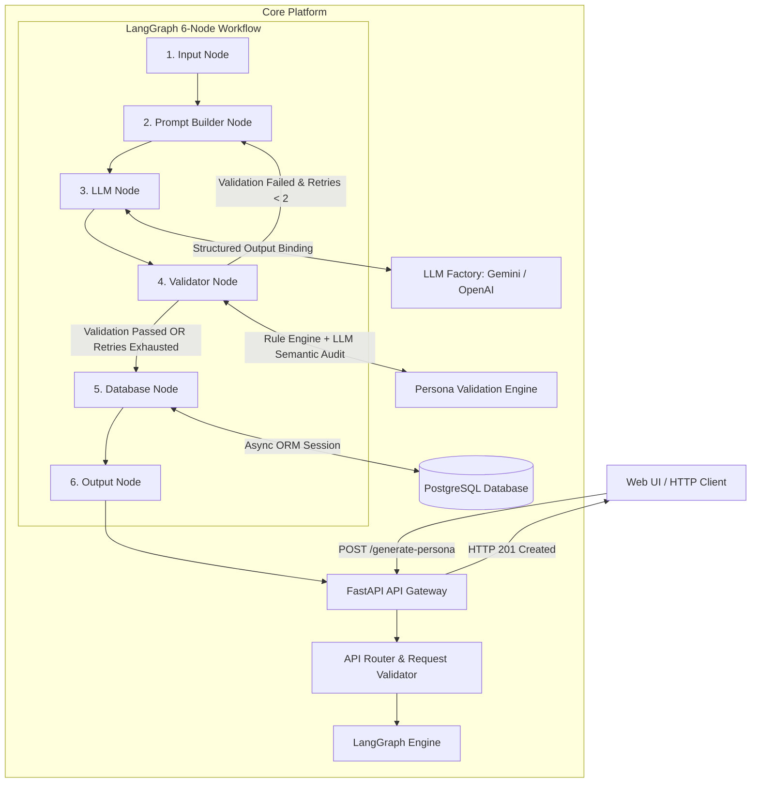

# 02. System Architecture

## 1. High-Level Architectural Diagram

## 2. Layered Responsibilities & Design Patterns

1. **API Gateway Layer (`app/api/`)**: Controller Pattern. Handles REST routes, HTTP status codes, and dependency injection (`Depends()`).
2. **Agent Engine Layer (`app/agent/`)**: State Machine & Builder Pattern. Constructs prompts and executes LangGraph state graphs.
3. **Quality Validation Layer (`app/validation/`)**: Strategy & Rule Engine Pattern. Runs rule-based and LLM semantic checks.
4. **Data Persistence Layer (`app/db/`)**: Data Mapper ORM Pattern. PostgreSQL persistence using SQLAlchemy 2.0.
5. **Infrastructure Layer (`app/core/`)**: Factory Method & Singleton Pattern. Loads configurations and manages LLM provider instances.
