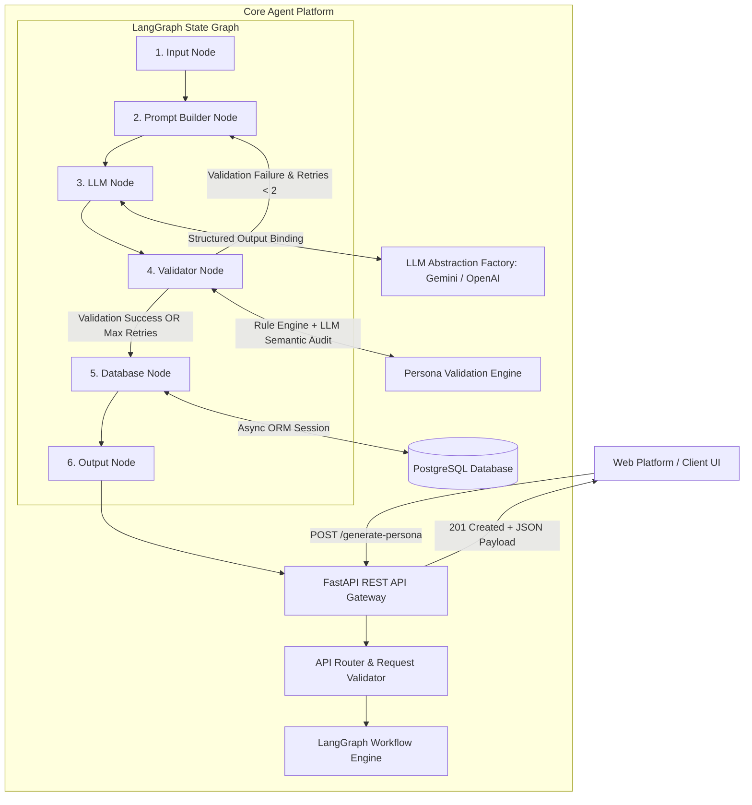
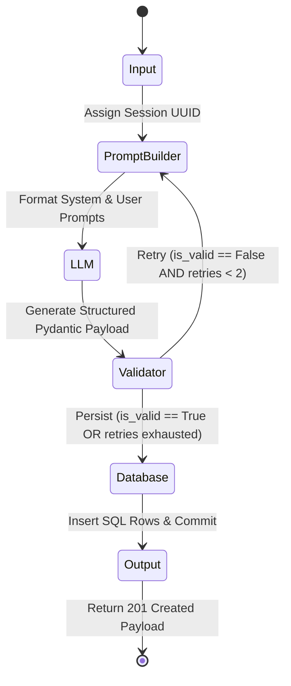

# Enterprise Solution Architecture Blueprint: Synthetic User Research Platform

**System Component**: Persona Generation Agent for Aspiring Software Engineers  
**Target Domain**: Synthetic User Research & Product Discovery  
**Author**: Lead AI Solution Architect  
**Technology Stack**: Python 3.11+, FastAPI, LangGraph, Pydantic v2, Google Gemini / OpenAI, PostgreSQL, SQLAlchemy 2.0  

---

## 1. Problem Statement

Traditional user research for software products—especially those targeting **aspiring software engineers**—suffers from significant operational bottlenecks:
1. **Recruitment Friction & High Cost**: Finding, screening, and scheduling interviews with diverse candidate cohorts (ranging from Tier-1 university students to self-taught bootcamp candidates in regional hubs) requires weeks of lead time and heavy financial incentives.
2. **Sampling Bias & Homogeneity**: Qualitative user research often over-indexes on vocal, privileged urban demographics, ignoring the nuanced realities of aspiring engineers from Tier-2/Tier-3 cities, non-traditional backgrounds, or low-infrastructure environments.
3. **Superficial LLM Personas**: naive single-prompt LLM generation produces cliché, stereotypical personas (e.g. assuming every candidate is an elite CS major grinding LeetCode 10 hours a day for FAANG).
4. **Lack of Internal Consistency & Persistence**: Ad-hoc LLM responses often suffer from logical contradictions (e.g., claiming to be a full-time remote developer with an age of 16, or claiming high tech-savviness while lacking access to basic hardware).

### Solution Vision
The **Persona Generation Agent** automates the synthesis of multi-dimensional, internally consistent, validated, and stereotype-resistant synthetic user personas. These personas serve as persistent cognitive agents for downstream synthetic usability testing, mock interview simulations, and feature prioritization.

---

## 2. High-Level Enterprise Architecture

The platform follows a microservice-ready, layered architecture separating API concerns, agent state machine execution, validation rules, and relational data persistence.



---

## 3. End-to-End Workflow

1. **Ingestion & Validation**: Client sends `product_description`, `target_audience`, and `research_objective` to `POST /generate-persona`. FastAPI validates payload types via Pydantic (`GeneratePersonaRequest`).
2. **Session Initialization**: `Input Node` assigns a persistent UUID session ID (`session_id`) and sets up state defaults.
3. **Contextual Prompt Building**: `Prompt Builder Node` constructs stereotype-resistant prompts targeting the specified audience (e.g., aspiring software engineers).
4. **Structured LLM Synthesis**: `LLM Node` invokes Gemini (`gemini-1.5-pro`) or OpenAI (`gpt-4o`) using `.with_structured_output(ComprehensivePersona)` to guarantee valid JSON serialization.
5. **Quality & Consistency Verification**: `Validator Node` executes deterministic rules (Age vs Occupation, Skills vs Education, Income bounds) and optional semantic audit.
   - *Self-Correction Branch*: If blocking errors exist, the state machine routes back to `Prompt Builder` with error feedback for LLM re-synthesis (up to 2 retries).
6. **Relational Persistence**: `Database Node` writes `ResearchSession`, `Persona`, and `ValidationStatus` records to PostgreSQL using SQLAlchemy 2.0.
7. **Client Response Delivery**: `Output Node` formats the final `201 Created` HTTP JSON response.

---

## 4. Agent Responsibilities & Cognitive Roles

| Role Name | Scope & Responsibilities | Enterprise Architectural Benefit |
| :--- | :--- | :--- |
| **Archetype Planner** | Decomposes target audience into non-overlapping persona blueprints. | Prevents cohort redundancy and guarantees demographic diversity. |
| **Persona Synthesizer** | Generates detailed 12-section persona profiles adhering strictly to schema. | Decouples prompt formatting from execution logic. |
| **Consistency Validator** | Validates internal field coherence (age/seniority, income bounds, skills). | Ensures high-fidelity data quality before downstream simulation. |
| **Cohort Auditor** | Analyzes the generated cohort as a collective unit against research goals. | Provides executive stakeholders with qualitative coverage metrics. |

---

## 5. Prompt Engineering Strategy (Stereotype Resistance & Structured Binding)

To generate authentic personas of **Aspiring Software Engineers** without falling into monolithic caricatures, the prompt engineering strategy enforces:

1. **Explicit Diversity Directives**:
   - **College Tiers**: Tier-1 (IITs/NITs/BITS), Tier-2 (State Universities/Private Universities), Tier-3 (Affiliated regional engineering colleges), and Non-CS/Self-taught bootcamp candidates.
   - **Geographic Spectrum**: Metro tech hubs (Bengaluru, Hyderabad, Pune, NCR), Tier-2 hubs (Kochi, Jaipur, Ahmedabad), and Tier-3 regional towns.
   - **Infrastructure Constraints**: Explicitly modeling hardware (e.g. 5-year-old dual-core laptops vs modern MacBooks), internet setups (mobile 5G hotspots vs fiber), and learning budgets in local currency (INR).
2. **Structured Output Enforcement**:
   - Eliminates raw text parsing by binding Pydantic models directly to model output via `with_structured_output(ComprehensivePersona)`.
3. **Feedback-Driven Auto-Correction**:
   - When validation fails, the validator's exact error list is injected directly into the retry prompt (`[PREVIOUS VALIDATION ERRORS TO FIX]`), forcing the LLM to self-correct field inconsistencies.

---

## 6. Comprehensive Persona Schema (`ComprehensivePersona`)

The persona schema comprises 12 distinct multi-dimensional modules:

```python
class BasicInformation(BaseModel):
    persona_id: str
    full_name: str
    avatar_description: str
    bio: str

class Demographics(BaseModel):
    age: int
    gender: str
    ethnicity: Optional[str]
    location: str
    marital_status: str
    household_income: str

class Education(BaseModel):
    degree_level: str
    field_of_study: str
    institution_type: str

class Occupation(BaseModel):
    job_title: str
    industry: str
    company_size: str
    work_mode: str
    key_responsibilities: List[str]

class Goals(BaseModel):
    primary_goals: List[str]
    secondary_goals: List[str]
    personal_aspirations: List[str]

class Motivations(BaseModel):
    intrinsic_motivations: List[str]
    extrinsic_motivations: List[str]
    core_values: List[str]

class Challenges(BaseModel):
    pain_points: List[str]
    daily_frustrations: List[str]
    workflow_blockers: List[str]

class Behaviour(BaseModel):
    decision_making_style: str
    purchasing_behavior: str
    media_consumption: List[str]
    discovery_channels: List[str]

class PersonalityTraits(BaseModel):
    big_five_summary: Dict[str, str]
    key_traits: List[str]
    communication_style: str
    attitude_towards_change: str

class TechnicalSkills(BaseModel):
    overall_proficiency: str
    domain_expertise: List[str]
    software_proficiency: Dict[str, str]

class TechnologyUsage(BaseModel):
    primary_devices: List[str]
    operating_systems: List[str]
    favorite_apps: List[str]
    daily_screen_time_hours: float
    tech_adoption_stage: str

class ComprehensivePersona(BaseModel):
    basic_info: BasicInformation
    demographics: Demographics
    education: Education
    occupation: Occupation
    goals: Goals
    motivations: Motivations
    challenges: Challenges
    behaviour: Behaviour
    personality_traits: PersonalityTraits
    technical_skills: TechnicalSkills
    technology_usage: TechnologyUsage
    quote: str
```

---

## 7. Validation Rules Matrix

| Rule Category | Verification Condition | Severity | Action on Failure |
| :--- | :--- | :--- | :--- |
| **`MISSING_REQUIRED_FIELD`** | `full_name`, `quote`, `primary_goals`, `pain_points` must be non-empty. | `ERROR` | Re-trigger generation with missing field feedback. |
| **`AGE_OCCUPATION_MISMATCH`** | Age < 18 or < 24 holding Executive/Senior titles (`Director`, `VP`, `Chief`). | `ERROR` | Flag mismatch; trigger LLM auto-correction retry. |
| **`SKILL_EDUCATION_MISMATCH`** | High school level claiming "Expert" tech skills without self-taught context in bio. | `WARNING` | Record warning in `validation_statuses` log. |
| **`UNREALISTIC_INCOME`** | Student/Intern claiming >$150k income, or VP claiming <$20k in high-cost cities. | `WARNING`/`ERROR` | Flag income bounds mismatch; trigger adjustment. |
| **`CONTRADICTION`** | Narrative contradictions (e.g. quote rejecting paid apps vs behavior buying trials). | `ERROR` | LLM semantic audit flags issue for prompt re-synthesis. |

---

## 8. Enterprise Folder Structure

```text
synthatic_user_genration/
├── app/
│   ├── __init__.py
│   ├── main.py                     # FastAPI Application Initialization & Router Mounting
│   ├── core/
│   │   ├── config.py               # Application Settings & API Key Management
│   │   └── llm_factory.py          # Unified LLM Provider Factory (Gemini & OpenAI)
│   ├── models/
│   │   ├── request.py              # REST API Request & Response Schemas
│   │   └── persona.py              # Pydantic Persona Schemas (12 Sub-modules)
│   ├── agent/
│   │   ├── persona_agent.py        # PersonaGenerationAgent & PersonaPromptBuilder Classes
│   │   ├── prompts_india_swe.py    # Anti-Stereotype Prompt Specifications
│   │   ├── state_graph.py          # 6-Node LangGraph Execution Workflow
│   │   └── graph.py                # Graph compilation utilities
│   ├── validation/
│   │   ├── models.py               # ValidationIssue & ValidationResult Schemas
│   │   └── validator.py            # Rule-based & Semantic Persona Validation Engine
│   ├── db/
│   │   ├── base.py                 # SQLAlchemy Declarative Base & Mixins
│   │   └── models.py               # ORM Models (ResearchSession, Persona, ValidationStatus)
│   └── api/
│       └── v1/
│           └── router.py           # REST Endpoint Controllers (POST /generate-persona)
├── scripts/
│   ├── generate_india_swe_personas.py
│   ├── run_persona_agent_demo.py
│   └── test_persona_validator.py
├── requirements.txt
└── README.md
```

---

## 9. API Design (`POST /generate-persona`)

- **HTTP Method**: `POST /generate-persona`
- **Success Status**: `201 Created`
- **Response Model**: `ComprehensivePersona`

### Ingress Request Body
```json
{
  "product_description": "An AI-powered Coding Interview Simulator conducting voice-based technical mock interviews in DSA and System Design.",
  "target_audience": "Aspiring software engineers in India across Tier-1, Tier-2, and Tier-3 colleges.",
  "research_objective": "Understand price sensitivity in INR, willingness to practice with AI vs human mentors, and feature priorities.",
  "provider": "gemini",
  "model_name": "gemini-1.5-pro"
}
```

---

## 10. Database Schema (PostgreSQL DDL)

```sql
-- Research Sessions Table
CREATE TABLE research_sessions (
    id UUID PRIMARY KEY DEFAULT gen_random_uuid(),
    product_description TEXT NOT NULL,
    target_audience TEXT NOT NULL,
    research_objective TEXT NOT NULL,
    requested_persona_count INTEGER NOT NULL DEFAULT 3,
    provider VARCHAR(50) NOT NULL DEFAULT 'gemini',
    model_name VARCHAR(100),
    status VARCHAR(50) NOT NULL DEFAULT 'PENDING',
    cohort_diversity_analysis TEXT,
    created_at TIMESTAMPTZ NOT NULL DEFAULT NOW(),
    updated_at TIMESTAMPTZ NOT NULL DEFAULT NOW()
);

-- Personas Table
CREATE TABLE personas (
    id UUID PRIMARY KEY DEFAULT gen_random_uuid(),
    research_session_id UUID NOT NULL REFERENCES research_sessions(id) ON DELETE CASCADE,
    persona_id_slug VARCHAR(100) NOT NULL,
    full_name VARCHAR(200) NOT NULL,
    archetype_title VARCHAR(200) NOT NULL,
    age INTEGER NOT NULL,
    gender VARCHAR(50) NOT NULL,
    occupation VARCHAR(200) NOT NULL,
    location VARCHAR(200) NOT NULL,
    quote TEXT NOT NULL,
    full_persona_json JSONB NOT NULL,
    is_validated BOOLEAN NOT NULL DEFAULT FALSE,
    overall_quality_score FLOAT,
    created_at TIMESTAMPTZ NOT NULL DEFAULT NOW(),
    updated_at TIMESTAMPTZ NOT NULL DEFAULT NOW()
);

-- Validation Statuses Table
CREATE TABLE validation_statuses (
    id UUID PRIMARY KEY DEFAULT gen_random_uuid(),
    persona_id UUID NOT NULL REFERENCES personas(id) ON DELETE CASCADE,
    is_valid BOOLEAN NOT NULL,
    quality_score FLOAT NOT NULL,
    errors_json JSONB NOT NULL DEFAULT '[]'::jsonb,
    warnings_json JSONB NOT NULL DEFAULT '[]'::jsonb,
    validator_version VARCHAR(50) NOT NULL DEFAULT '1.0.0',
    created_at TIMESTAMPTZ NOT NULL DEFAULT NOW(),
    updated_at TIMESTAMPTZ NOT NULL DEFAULT NOW()
);

-- Generated Responses Table
CREATE TABLE generated_responses (
    id UUID PRIMARY KEY DEFAULT gen_random_uuid(),
    research_session_id UUID NOT NULL REFERENCES research_sessions(id) ON DELETE CASCADE,
    persona_id UUID NOT NULL REFERENCES personas(id) ON DELETE CASCADE,
    prompt_question TEXT NOT NULL,
    simulated_response TEXT NOT NULL,
    sentiment_label VARCHAR(50),
    sentiment_score FLOAT,
    perceived_friction_level VARCHAR(50),
    execution_metadata JSONB,
    created_at TIMESTAMPTZ NOT NULL DEFAULT NOW(),
    updated_at TIMESTAMPTZ NOT NULL DEFAULT NOW()
);
```

---

## 11. LangGraph Execution Flow



---

## 12. Future Enterprise Roadmap

1. **Synthetic Interview Simulation Agent**: Connect generated personas into an interactive conversational agent loop where product managers can conduct real-time Q&A interviews with the synthetic persona.
2. **RAG Integration with Empirical Research**: Augment LLM prompts with real user interview transcripts, survey databases, and forum discussions (e.g. Reddit, StackOverflow) via Vector Search (pgvector / Qdrant).
3. **Observability & Tracing**: Integrate **LangSmith** or **OpenTelemetry** for token cost monitoring, latency tracing, and model drift analysis across cohort generations.
4. **Domain-Specific Fine-Tuned LLMs**: Fine-tune open-weight models (e.g. Llama 3 / Mistral) specifically on anonymized developer user research datasets for localized persona fidelity.
