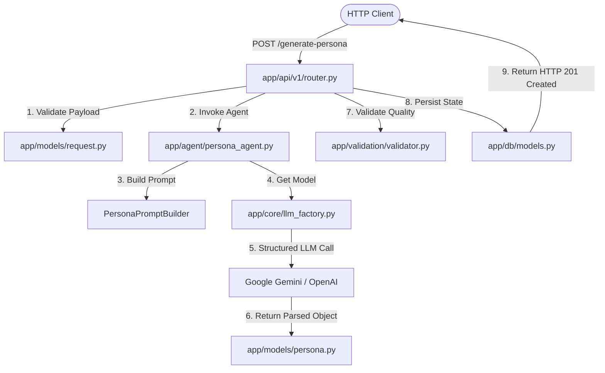

# Enterprise Project Handover Guide

**Project Name**: AI-Powered Synthetic User Research Platform (Persona Generation Subsystem)  
**Document Type**: Technical Handover & Transition Guide  
**Departing Lead Architect**: Lead AI Solution Architect & Core Developer  
**Target Recipient**: Successor Software Engineer / Lead Developer  
**Status**: Production-Ready / Fully Implemented  
**Repository Location**: `c:\Users\gadde\OneDrive\Desktop\synthatic_user_genration`  

---

## 1. Executive Handover Summary & Project Genesis

Welcome to the team! As I prepare to transition off this project, I want to ensure you have complete clarity on why every architectural decision was made, how every module functions, and how to successfully operate and scale this platform.

### Why We Built This System
Product development teams frequently struggle with **qualitative user research bottlenecks**:
- Scheduling human candidate interviews takes weeks and costs thousands of dollars.
- User research sampling is often biased toward loud or privileged demographics.
- Naive LLM prompts generate generic, superficial, and stereotypical user personas (e.g. assuming every software engineer is an elite CS grad grinding LeetCode 10 hours a day).

To solve this, I designed and built this **Persona Generation Subsystem**. It combines **FastAPI**, **LangGraph 6-Node State Graphs**, **Pydantic V2 Type Contracts**, **Google Gemini & OpenAI Unified Factories**, **Rule-based & Semantic Validation**, and **PostgreSQL Persistence**.

---

## 2. Key Architectural Design Decisions & Rationale

| Design Decision | Alternative Considered | Why My Decision Was Chosen |
| :--- | :--- | :--- |
| **LangGraph 6-Node StateGraph Workflow** | Simple linear script or LangChain SequentialChain | Allowed building an explicit self-correction retry loop where validation failures trigger automatic prompt re-formatting and LLM re-synthesis before persisting data. |
| **Pydantic V2 `with_structured_output`** | Regex string parsing or unconstrained JSON generation | Guarantees strict type validation and standard JSON schemas directly output by LLMs, eliminating JSON parse errors. |
| **Unified LLM Factory (`llm_factory.py`)** | Hardcoding OpenAI or Gemini API calls in nodes | Provides provider abstraction (`"gemini"` vs `"openai"`). The team can switch models across environments without modifying agent logic. |
| **PostgreSQL `JSONB` + Indexed Fields** | Pure EAV (Entity-Attribute-Value) or pure document DB | Combines SQL relational integrity (UUID foreign keys, session links) with JSON flexiblity for complex multi-dimensional persona payloads. |
| **OOP `PersonaGenerationAgent` Class** | Function scripts with global state | Eliminates global state, enables clean dependency injection (injecting mock LLMs in unit tests), and adheres to SOLID design principles. |

---

## 3. Folder-by-Folder Ownership & Rationale

```text
synthatic_user_genration/
├── app/                        # Application Root Package
│   ├── main.py                 # FastAPI Application Entrypoint & Middleware
│   ├── core/                   # Infrastructure, Configuration & LLM Factory
│   │   ├── config.py           # Pydantic BaseSettings & Environment Parser
│   │   └── llm_factory.py      # Unified LLM Provider Factory
│   ├── models/                 # Data Contracts & Schemas
│   │   ├── request.py          # REST API Request & Response Models
│   │   └── persona.py          # 12-Module Persona Domain Schemas
│   ├── agent/                  # AI State Graphs & Prompt Engineering
│   │   ├── persona_agent.py    # OOP Persona Generation Classes
│   │   ├── prompts_india_swe.py# Anti-Stereotype Prompt Specifications
│   │   ├── state_graph.py      # 6-Node LangGraph StateGraph Engine
│   │   ├── prompts.py          # Generic System Prompts
│   │   ├── nodes.py            # Async Execution Nodes
│   │   ├── graph.py            # Legacy Graph Assembly
│   │   └── state.py            # Legacy State TypedDict
│   ├── validation/             # Quality & Verification Engine
│   │   ├── models.py           # Validation Issue & Result Schemas
│   │   └── validator.py        # Rule-Based & Semantic Validation Engine
│   ├── db/                     # Relational Persistence Layer
│   │   ├── base.py             # Declarative Base & ORM Mixins
│   │   └── models.py           # SQLAlchemy 2.0 ORM Models
│   └── api/                    # REST API Controllers
│       └── v1/
│           └── router.py       # Endpoint Router for POST /generate-persona
└── scripts/                    # Standalone CLI Test & Demo Runners
```

### Why Each Folder Exists:
- **`app/core/`**: Isolates infrastructure configuration so credentials and LLM instantiations don't contaminate application logic.
- **`app/models/`**: Centralizes domain data contracts. Serves as the single source of truth for Pydantic types.
- **`app/agent/`**: Holds all state machine logic. Keeps prompt engineering and graph execution separate from web routing.
- **`app/validation/`**: Contains business quality control rules. Prevents bad synthetic data from being persisted or served to clients.
- **`app/db/`**: Handles database persistence using SQLAlchemy 2.0 ORM.
- **`app/api/v1/`**: Exposes REST HTTP endpoints following RESTful standards.

---

## 4. Comprehensive Class & Function Reference

### 4.1. `app/core/llm_factory.py`
- **Function `get_llm(provider, model_name)`**: Instantiates `ChatGoogleGenerativeAI` or `ChatOpenAI` based on the provider string. Handles API key resolution automatically.

### 4.2. `app/agent/persona_agent.py`
- **Class `PersonaPromptBuilder`**:
  - `build_archetype_planning_prompt()`: Returns `ChatPromptTemplate` for planning $N$ archetypes.
  - `build_persona_synthesis_prompt()`: Returns `ChatPromptTemplate` for generating detailed personas.
- **Class `PersonaGenerationAgent`**:
  - `generate_single_persona(...)`: Asynchronously builds prompts, binds structured outputs, invokes LLMs, and returns `ComprehensivePersona` Pydantic instances.
  - `generate_persona_cohort(...)`: Plans archetypes and generates a cohort of $N$ personas.

### 4.3. `app/agent/state_graph.py`
- **Class `PersonaWorkflowState(TypedDict)`**: State payload passed between graph nodes.
- **Nodes**:
  - `input_node()`: Assigns session UUID and initializes state defaults.
  - `prompt_builder_node()`: Formats prompts and appends error feedback during retries.
  - `llm_node()`: Calls LLM with structured output binding.
  - `validator_node()`: Executes rule checks on generated personas.
  - `database_node()`: Simulates PostgreSQL ORM database writes.
  - `output_node()`: Formats HTTP API response payload.
- **Router `should_retry_or_persist()`**: Directs flow to `Prompt Builder` for auto-correction if validation fails, or to `Database` if valid.

### 4.4. `app/validation/validator.py`
- **Class `PersonaValidator`**:
  - `validate_deterministic(persona)`: Checks required non-empty fields, age vs seniority (e.g. age < 18 or < 24 holding VP/Director titles), skills vs education, and income bounds.
  - `audit_semantic_consistency(persona)`: Invokes LLM to check cross-field narrative self-contradictions.
  - `validate(persona)`: Combines deterministic and semantic checks, computing quality score out of 100.

### 4.5. `app/db/models.py`
- **ORM Classes**:
  - `ResearchSession`: Maps to `research_sessions` table.
  - `Persona`: Maps to `personas` table with `full_persona_json` (`JSONB`).
  - `ValidationStatus`: Maps to `validation_statuses` table.
  - `GeneratedResponse`: Maps to `generated_responses` table.

---

## 5. End-to-End Execution & Data Flow



---

## 6. How the Successor Developer Should Continue & Extend the Project

As you take over this codebase, here is your roadmap for maintaining, scaling, and extending the platform:

### 6.1. Immediate Setup Checklist
1. **Environment Setup**:
   ```bash
   python -m venv venv
   source venv/bin/activate  # Or venv\Scripts\activate on Windows
   pip install -r requirements.txt
   ```
2. **Environment Variables**: Create a `.env` file in the root directory:
   ```env
   GOOGLE_API_KEY=your_gemini_api_key_here
   OPENAI_API_KEY=your_openai_api_key_here
   ```
3. **Run API Server**:
   ```bash
   uvicorn app.main:app --reload --port 8000
   ```
4. **Test Endpoints**: Visit `http://localhost:8000/docs` to test `POST /generate-persona`.

### 6.2. Key Next Features to Implement (Product Roadmap)
1. **Interactive Persona Chat Agent**:
   - Create a new endpoint `POST /personas/{id}/chat` that instantiates a conversational agent initialized with the persona's bio, psychographics, and quote to allow product managers to "interview" the persona in real-time.
2. **Database Migrations with Alembic**:
   - Initialize Alembic (`alembic init alembic`) to manage database schema evolution as new persona fields are added.
3. **Vector Database Grounding (RAG)**:
   - Connect `app/agent/persona_agent.py` to a vector store (Qdrant or PostgreSQL `pgvector`) containing real user interview transcripts to ground synthetic personas in empirical user research data.
4. **Observability & Tracing**:
   - Add **LangSmith** or **OpenTelemetry** integration in `app/core/config.py` for monitoring token usage, latency, and model quality metrics across generations.

### 6.3. Crucial Maintenance Guidelines
- **Always update Pydantic models first**: When modifying the persona schema, update [`app/models/persona.py`](file:///c:/Users/gadde/OneDrive/Desktop/synthatic_user_genration/app/models/persona.py) first. LangChain's structured output binding relies on these schemas.
- **Run validation scripts before pushing code**: Execute `python scripts/test_persona_validator.py` and `python scripts/run_persona_agent_demo.py` to verify that rule engine logic remains intact.

I am confident this platform gives you a solid, production-grade foundation. Good luck taking it to the next level!
