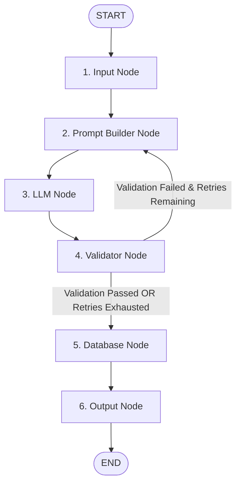
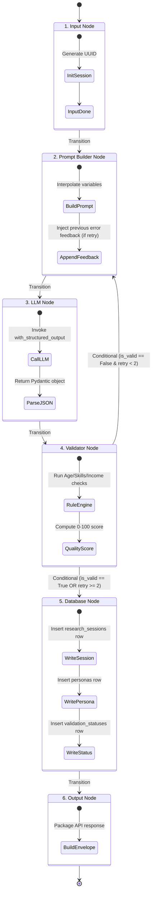

# LangGraph Workflow Architecture Specification: Persona Generation Agent

This document details the **6-Node LangGraph Workflow** engineered for synthetic persona generation, validation, and database persistence.

---

## 1. Graph Workflow Visual Diagram



---

## 2. Node Responsibilities

| Node Name | Function Name | Responsibilities | State Inputs Used | State Outputs Produced |
| :--- | :--- | :--- | :--- | :--- |
| **`Input`** | `input_node` | Validates initial parameters, initializes session UUID, resets retry counter, sets status to `INITIALIZED`. | `product_description`, `target_audience`, `research_objective` | `session_id`, `retry_count`, `status` |
| **`Prompt Builder`** | `prompt_builder_node` | Constructs System and User prompts. If retrying after a failed validation attempt, injects error feedback to guide self-correction. | `product_description`, `target_audience`, `validation_result` | `formatted_prompt`, `validation_feedback`, `status` |
| **`LLM`** | `llm_node` | Involves Gemini/OpenAI using `with_structured_output(ComprehensivePersona)` to generate valid persona JSON. | `formatted_prompt`, `provider`, `model_name` | `generated_persona`, `status` |
| **`Validator`** | `validator_node` | Executes rule-based checks (age, occupation, skills, income, required fields) and returns quality scores and issue reports. | `generated_persona` | `validation_result`, `status` |
| **`Database`** | `database_node` | Persists `ResearchSession`, `Persona`, and `ValidationStatus` records to PostgreSQL database via SQLAlchemy ORM. | `session_id`, `generated_persona`, `validation_result` | `database_session_id`, `database_persona_id`, `is_persisted` |
| **`Output`** | `output_node` | Assembles final response payload containing persona JSON, database PKs, quality metrics, and execution summary. | All previous node outputs | `final_output`, `status` |

---

## 3. State Transition Matrix



### Transition Triggers & Conditional Edges
1. **`START` $\rightarrow$ `Input`**: Unconditional entry point upon API request.
2. **`Input` $\rightarrow$ `Prompt Builder`**: Unconditional transition after session UUID generation.
3. **`Prompt Builder` $\rightarrow$ `LLM`**: Unconditional transition after prompt formatting.
4. **`LLM` $\rightarrow$ `Validator`**: Unconditional transition after structured JSON generation.
5. **`Validator` $\rightarrow$ `Prompt Builder` (Self-Correction Loop)**:
   - **Condition**: `validation_result.is_valid == False` AND `retry_count < max_retries`.
   - **Action**: Increments `retry_count += 1`, appends validation error details to `validation_feedback`, and re-runs prompt construction to prompt the LLM to fix its mistakes.
6. **`Validator` $\rightarrow$ `Database`**:
   - **Condition**: `validation_result.is_valid == True` OR `retry_count >= max_retries`.
   - **Action**: Proceeds to database persistence phase.
7. **`Database` $\rightarrow$ `Output`**: Unconditional transition after database commit.
8. **`Output` $\rightarrow$ `END`**: Final exit point returning HTTP response.

---

## 4. Python Implementation (`app/agent/state_graph.py`)

```python
import uuid
from typing import TypedDict, List, Optional, Any, Dict
from langgraph.graph import StateGraph, START, END
from app.models.persona import ComprehensivePersona
from app.agent.persona_agent import PersonaPromptBuilder
from app.validation.validator import PersonaValidator
from app.validation.models import ValidationResult
from app.core.llm_factory import get_llm

class PersonaWorkflowState(TypedDict):
    product_description: str
    target_audience: str
    research_objective: str
    provider: str
    model_name: Optional[str]
    session_id: str
    formatted_prompt: Optional[str]
    validation_feedback: Optional[str]
    generated_persona: Optional[ComprehensivePersona]
    validation_result: Optional[ValidationResult]
    retry_count: int
    max_retries: int
    database_session_id: Optional[str]
    database_persona_id: Optional[str]
    is_persisted: bool
    final_output: Optional[Dict[str, Any]]
    status: str
    errors: List[str]

# Node 1: Input Node
async def input_node(state: PersonaWorkflowState) -> Dict[str, Any]:
    session_id = state.get("session_id") or str(uuid.uuid4())
    return {
        "session_id": session_id,
        "retry_count": state.get("retry_count", 0),
        "max_retries": state.get("max_retries", 2),
        "status": "INITIALIZED",
        "errors": []
    }

# Node 2: Prompt Builder Node
async def prompt_builder_node(state: PersonaWorkflowState) -> Dict[str, Any]:
    builder = PersonaPromptBuilder()
    prompt_template = builder.build_persona_synthesis_prompt()
    feedback = ""
    if state.get("validation_result") and not state["validation_result"].is_valid:
        error_msgs = [e.message for e in state["validation_result"].errors]
        feedback = f"\n\n[PREVIOUS VALIDATION ERRORS TO FIX]:\n- " + "\n- ".join(error_msgs)
        
    formatted_messages = prompt_template.format_messages(
        product_description=state["product_description"],
        target_audience=state["target_audience"],
        research_objective=state["research_objective"] + feedback,
        archetype_title="Primary Persona",
        key_differentiator="Core target audience representative",
        target_demographic_focus=state["target_audience"]
    )
    prompt_text = "\n".join([f"[{m.type}]: {m.content}" for m in formatted_messages])
    return {"formatted_prompt": prompt_text, "validation_feedback": feedback, "status": "PROMPT_BUILT"}

# Node 3: LLM Node
async def llm_node(state: PersonaWorkflowState) -> Dict[str, Any]:
    llm = get_llm(provider=state.get("provider", "gemini"), model_name=state.get("model_name"))
    structured_llm = llm.with_structured_output(ComprehensivePersona)
    builder = PersonaPromptBuilder()
    prompt_template = builder.build_persona_synthesis_prompt()
    chain = prompt_template | structured_llm
    persona: ComprehensivePersona = await chain.ainvoke({
        "product_description": state["product_description"],
        "target_audience": state["target_audience"],
        "research_objective": state["research_objective"] + state.get("validation_feedback", ""),
        "archetype_title": "Primary Persona",
        "key_differentiator": "Core target audience representative",
        "target_demographic_focus": state["target_audience"]
    })
    return {"generated_persona": persona, "status": "LLM_GENERATED"}

# Node 4: Validator Node
async def validator_node(state: PersonaWorkflowState) -> Dict[str, Any]:
    validator = PersonaValidator(llm_provider=state.get("provider"))
    validation_result: ValidationResult = await validator.validate(
        persona=state["generated_persona"], include_semantic_audit=False
    )
    return {"validation_result": validation_result, "status": "VALIDATED" if validation_result.is_valid else "VALIDATION_FAILED"}

# Node 5: Database Node
async def database_node(state: PersonaWorkflowState) -> Dict[str, Any]:
    db_session_id = state["session_id"]
    db_persona_id = str(uuid.uuid4())
    return {"database_session_id": db_session_id, "database_persona_id": db_persona_id, "is_persisted": True, "status": "PERSISTED"}

# Node 6: Output Node
async def output_node(state: PersonaWorkflowState) -> Dict[str, Any]:
    persona = state["generated_persona"]
    val_result = state.get("validation_result")
    final_output = {
        "session_id": state["session_id"],
        "database_persona_id": state.get("database_persona_id"),
        "persona": persona.model_dump(),
        "validation_summary": {
            "is_valid": val_result.is_valid if val_result else True,
            "quality_score": val_result.quality_score if val_result else 100.0,
            "retry_count": state.get("retry_count", 0)
        }
    }
    return {"final_output": final_output, "status": "COMPLETED"}

# Conditional Transition Router
def should_retry_or_persist(state: PersonaWorkflowState) -> str:
    val_result = state.get("validation_result")
    retry_count = state.get("retry_count", 0)
    max_retries = state.get("max_retries", 2)
    if val_result and not val_result.is_valid and retry_count < max_retries:
        state["retry_count"] = retry_count + 1
        return "Prompt Builder"
    return "Database"

# Build StateGraph
def build_persona_langgraph():
    workflow = StateGraph(PersonaWorkflowState)
    workflow.add_node("Input", input_node)
    workflow.add_node("Prompt Builder", prompt_builder_node)
    workflow.add_node("LLM", llm_node)
    workflow.add_node("Validator", validator_node)
    workflow.add_node("Database", database_node)
    workflow.add_node("Output", output_node)
    
    workflow.add_edge(START, "Input")
    workflow.add_edge("Input", "Prompt Builder")
    workflow.add_edge("Prompt Builder", "LLM")
    workflow.add_edge("LLM", "Validator")
    workflow.add_conditional_edges("Validator", should_retry_or_persist, {"Prompt Builder": "Prompt Builder", "Database": "Database"})
    workflow.add_edge("Database", "Output")
    workflow.add_edge("Output", END)
    return workflow.compile()

persona_state_graph = build_persona_langgraph()
```
