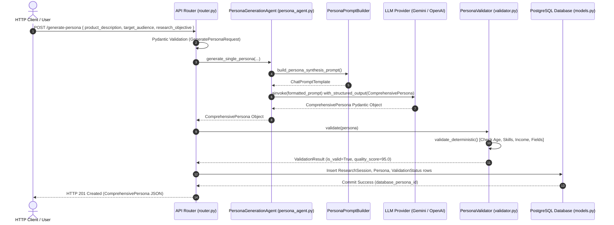

# Software Design Document (SDD)
## AI-Powered Synthetic User Research Platform — Persona Generation Subsystem

**Document Version**: 1.0.0  
**Author**: Original AI Solution Architect & Lead Developer  
**Target Audience**: Onboarding Engineers, Core Platform Developers, Technical Leads  
**Repository**: `c:\Users\gadde\OneDrive\Desktop\synthatic_user_genration`  

---

## Executive Overview

Welcome to the **Synthetic User Research Platform**! As the original architect and developer of this project, I created this system to revolutionize how product managers, UX researchers, and engineering teams conduct early-stage user discovery.

Instead of waiting weeks and spending thousands of dollars to recruit human interview candidates, this platform uses autonomous **LangGraph agents**, **Pydantic schema validation**, **unified LLM providers (Gemini & OpenAI)**, and **PostgreSQL database persistence** to generate, validate, and persist high-fidelity, multi-dimensional synthetic user personas.

This document serves as your complete developer onboarding guide and Software Design Document (SDD). It covers every directory, every single file, every class, function, workflow, and data transformation in exact detail.

---

## 1. Complete Folder Hierarchy

```text
synthatic_user_genration/
├── app/
│   ├── __init__.py                 # Package initializer for app module
│   ├── main.py                     # FastAPI application entry point & CORS configuration
│   ├── core/                       # Core configuration & unified provider abstractions
│   │   ├── __init__.py             # Package initializer for core module
│   │   ├── config.py               # Pydantic BaseSettings for environment variables & API keys
│   │   └── llm_factory.py          # Provider factory for Google Gemini & OpenAI model clients
│   ├── models/                     # Data contracts & Pydantic domain schemas
│   │   ├── __init__.py             # Package initializer for models module
│   │   ├── request.py              # REST API request payloads & response wrappers
│   │   └── persona.py              # Comprehensive multi-dimensional persona schema (12 sub-models)
│   ├── agent/                      # LangGraph state graph & prompt engineering engine
│   │   ├── __init__.py             # Package initializer for agent module
│   │   ├── persona_agent.py        # PersonaGenerationAgent & PersonaPromptBuilder OOP classes
│   │   ├── prompts.py              # Base system prompt templates
│   │   ├── prompts_india_swe.py    # Anti-stereotype prompt specifications for Indian SWEs
│   │   ├── state.py                # Legacy AgentState TypedDict dictionary
│   │   ├── nodes.py                # Execution functions for archetype planning & persona generation
│   │   ├── graph.py                # Legacy LangGraph state graph compilation
│   │   └── state_graph.py          # Production 6-node LangGraph StateGraph workflow with retry loop
│   ├── validation/                 # Hybrid rule-based & LLM semantic persona validator
│   │   ├── __init__.py             # Package initializer for validation module
│   │   ├── models.py               # ValidationIssue & ValidationResult Pydantic models
│   │   └── validator.py            # PersonaValidator engine (deterministic + semantic audit)
│   ├── db/                         # PostgreSQL database layer & ORM entities
│   │   ├── __init__.py             # Package initializer for db module
│   │   ├── base.py                 # DeclarativeBase, UUIDMixin, and TimestampMixin
│   │   └── models.py               # SQLAlchemy 2.0 ORM models (ResearchSession, Persona, etc.)
│   └── api/                        # REST API routing layer
│       ├── __init__.py             # Package initializer for api module
│       └── v1/                     # Version 1 API routes
│           ├── __init__.py         # Package initializer for api v1 module
│           └── router.py           # Endpoint controller for POST /generate-persona
├── scripts/                        # Standalone execution scripts, tests & CLI demos
│   ├── generate_india_swe_personas.py # Demo generation script for Indian SWE personas
│   ├── run_persona_agent_demo.py   # OOP PersonaGenerationAgent execution test
│   └── test_persona_validator.py   # Test suite for validation rules engine
├── requirements.txt                # Python project dependencies
└── README.md                       # High-level project summary
```

---

## 2. Folder-by-Folder Architectural Breakdown

### 2.1. `app/` Directory
- **Why it exists**: Contains the entire application source code. It isolates core business logic, API controllers, database models, and agent logic from standalone scripts and root configuration.
- **Responsibility**: Serves as the primary Python package root for runtime execution.
- **Communication**: Interacts with external clients via HTTP endpoints and connects to external database instances (PostgreSQL) and LLM APIs.
- **Design Pattern**: **Modular Monolith Architecture** / **Layered Architecture**.

### 2.2. `app/core/` Directory
- **Why it exists**: Centralizes application-wide settings, environment variable parsing, and infrastructure abstractions.
- **Responsibility**: Manages security credentials (`GOOGLE_API_KEY`, `OPENAI_API_KEY`) and provides a unified LLM factory interface.
- **Communication**: Imported by `app/agent/`, `app/validation/`, and `app/api/v1/router.py`.
- **Design Pattern**: **Factory Pattern** (`llm_factory.py`) and **Singleton Pattern** (`config.py`).

### 2.3. `app/models/` Directory
- **Why it exists**: Defines data transfer objects (DTOs) and domain schemas enforcing structural type safety across the application.
- **Responsibility**: Validates request payloads from HTTP clients and structures LLM outputs into strict Pydantic objects.
- **Communication**: Shared across `app/api/`, `app/agent/`, `app/validation/`, and `app/db/`.
- **Design Pattern**: **Data Transfer Object (DTO) Pattern** & **Domain Model Pattern**.

### 2.4. `app/agent/` Directory
- **Why it exists**: Houses all artificial intelligence cognitive logic, prompt templates, and state machines.
- **Responsibility**: Constructs prompt templates, orchestrates multi-step LangGraph workflows, and handles LLM structured output parsing.
- **Communication**: Consumes `app/core/` for LLM instantiation, `app/models/` for schema definitions, and passes generated personas to `app/validation/`.
- **Design Pattern**: **State Machine Pattern** (LangGraph `StateGraph`) & **Builder Pattern** (`PersonaPromptBuilder`).

### 2.5. `app/validation/` Directory
- **Why it exists**: Ensures synthetic personas meet strict quality standards, realistic demographics, and zero logical self-contradictions.
- **Responsibility**: Runs rule-based age/seniority, skills/education, and income checks alongside optional LLM semantic audits.
- **Communication**: Receives `ComprehensivePersona` from `app/agent/` and returns `ValidationResult` to `app/agent/state_graph.py` or `app/api/v1/router.py`.
- **Design Pattern**: **Strategy Pattern** / **Rule Engine Pattern**.

### 2.6. `app/db/` Directory
- **Why it exists**: Manages persistent storage of research sessions, personas, validation logs, and simulated user responses.
- **Responsibility**: Defines database tables, foreign key constraints, indexes, and SQLAlchemy 2.0 ORM mappings.
- **Communication**: Receives output from `app/agent/state_graph.py` to persist generated state into PostgreSQL.
- **Design Pattern**: **Object-Relational Mapping (ORM) Pattern** & **Active Record / Data Mapper**.

### 2.7. `app/api/` and `app/api/v1/` Directories
- **Why it exists**: Exposes application capabilities over standard HTTP REST interfaces.
- **Responsibility**: Handles HTTP requests, URL routing, dependency injection (`Depends()`), and OpenAPI metadata generation.
- **Communication**: Bridges HTTP requests from external clients to internal agents (`app/agent/`) and validators (`app/validation/`).
- **Design Pattern**: **Controller Pattern** / **Routing Gateway**.

### 2.8. `scripts/` Directory
- **Why it exists**: Stores standalone runnable scripts for testing, benchmarking, and demonstration purposes.
- **Responsibility**: Provides CLI entry points to test agents, prompts, and validation modules without spinning up the web server.
- **Communication**: Calls `app/` submodules directly.
- **Design Pattern**: **Script / Command CLI Pattern**.

---

## 3. Comprehensive File-by-File Technical Analysis

---

### 3.1. `requirements.txt`
- **Purpose**: Defines explicit Python package dependencies and version constraints for the project.
- **Why Created**: Ensures deterministic, reproducible environment builds across development, testing, and production deployment.
- **Dependencies**: `fastapi`, `uvicorn`, `pydantic`, `pydantic-settings`, `langgraph`, `langchain-core`, `langchain-google-genai`, `langchain-openai`, `python-dotenv`.
- **Called By**: Package installers (`pip install -r requirements.txt`).

---

### 3.2. `app/__init__.py`
- **Purpose**: Marks `app` as a Python package directory.
- **Why Created**: Allows Python to resolve imports starting with `from app...`.
- **Contents**: Empty package initializer file.

---

### 3.3. `app/core/__init__.py`
- **Purpose**: Marks `app.core` as a Python subpackage.
- **Why Created**: Enables clean importing of configuration and factory modules (`from app.core.config import settings`).
- **Contents**: Empty package initializer file.

---

### 3.4. `app/core/config.py`
- **Purpose**: Loads environment variables from `.env` files and manages application configuration parameters.
- **Why Created**: Eliminates hardcoded API keys and centralizes settings management using Pydantic Settings.
- **Classes**:
  - `Settings(BaseSettings)`: Holds `PROJECT_NAME`, `API_V1_STR`, `GOOGLE_API_KEY`, `OPENAI_API_KEY`, `DEFAULT_GEMINI_MODEL`, `DEFAULT_OPENAI_MODEL`.
- **Global Objects**: `settings = Settings()`
- **Inputs**: `.env` file or operating system environment variables.
- **Outputs**: Instantiated `settings` singleton object.
- **Dependencies**: `pydantic_settings.BaseSettings`.
- **Called By**: `app/core/llm_factory.py`, `app/main.py`.

---

### 3.5. `app/core/llm_factory.py`
- **Purpose**: Provides a unified factory function to instantiate LangChain LLM instances (`ChatGoogleGenerativeAI` or `ChatOpenAI`).
- **Why Created**: Decouples application agent code from specific provider implementations. Switching between Gemini and OpenAI requires zero code changes in agents.
- **Functions**:
  - `get_llm(provider: str = "gemini", model_name: Optional[str] = None) -> BaseChatModel`:
    - **What it does**: Reads provider name (lowercased), fetches corresponding API key from `settings` or OS environment, instantiates the target chat model with temperature `0.7`, and returns it.
    - **Inputs**: `provider` (`"gemini"` or `"openai"`), `model_name` (optional model override string like `"gemini-1.5-pro"` or `"gpt-4o"`).
    - **Outputs**: Configured `BaseChatModel` instance.
- **Dependencies**: `langchain_core.language_models.BaseChatModel`, `langchain_google_genai.ChatGoogleGenerativeAI`, `langchain_openai.ChatOpenAI`, `app.core.config.settings`.
- **Called By**: `app/agent/persona_agent.py`, `app/agent/nodes.py`, `app/agent/state_graph.py`, `app/validation/validator.py`, `app/api/v1/router.py`.

---

### 3.6. `app/models/__init__.py`
- **Purpose**: Marks `app.models` as a Python subpackage.
- **Why Created**: Enables clean importing of data models.
- **Contents**: Empty package initializer file.

---

### 3.7. `app/models/request.py`
- **Purpose**: Defines request and response Pydantic models for API endpoints.
- **Why Created**: Enforces strict input validation on HTTP POST payloads and provides clean OpenAPI documentation schemas.
- **Classes**:
  - `GeneratePersonaRequest(BaseModel)`:
    - **Fields**: `product_description` (min length 10), `target_audience` (min length 5), `research_objective` (min length 10), `provider` (`"gemini"` or `"openai"`), `model_name` (optional).
  - `PersonaGenerationResponse(BaseModel)`:
    - **Fields**: `success` (bool), `message` (str), `persona` (dict), `quality_score` (optional float).
- **Dependencies**: `pydantic.BaseModel`, `pydantic.Field`, `typing.Literal`.
- **Called By**: `app/api/v1/router.py`, `app/agent/state_graph.py`.

---

### 3.8. `app/models/persona.py`
- **Purpose**: Defines the complete multi-dimensional synthetic persona domain schema using Pydantic V2.
- **Why Created**: Provides a rich 12-section persona model for UX research and structured LLM JSON output binding.
- **Classes**:
  - `BasicInformation(BaseModel)`: `persona_id`, `full_name`, `avatar_description`, `bio`.
  - `Demographics(BaseModel)`: `age`, `gender`, `ethnicity`, `location`, `marital_status`, `household_income`.
  - `Education(BaseModel)`: `degree_level`, `field_of_study`, `institution_type`.
  - `Occupation(BaseModel)`: `job_title`, `industry`, `company_size`, `work_mode`, `key_responsibilities`.
  - `Goals(BaseModel)`: `primary_goals`, `secondary_goals`, `personal_aspirations`.
  - `Motivations(BaseModel)`: `intrinsic_motivations`, `extrinsic_motivations`, `core_values`.
  - `Challenges(BaseModel)`: `pain_points`, `daily_frustrations`, `workflow_blockers`.
  - `Behaviour(BaseModel)`: `decision_making_style`, `purchasing_behavior`, `media_consumption`, `discovery_channels`.
  - `PersonalityTraits(BaseModel)`: `big_five_summary`, `key_traits`, `communication_style`, `attitude_towards_change`.
  - `TechnicalSkills(BaseModel)`: `overall_proficiency`, `domain_expertise`, `software_proficiency`.
  - `TechnologyUsage(BaseModel)`: `primary_devices`, `operating_systems`, `favorite_apps`, `daily_screen_time_hours`, `tech_adoption_stage`.
  - `ComprehensivePersona(BaseModel)`: Combines all 11 sub-models plus a verbatim `quote`.
  - `ArchetypePlan(BaseModel)` & `ArchetypePlanList(BaseModel)`: Helper schemas for cohort diversity planning.
  - `PersonaCohort(BaseModel)`: Cohort wrapper containing multiple personas and a diversity analysis string.
- **Dependencies**: `pydantic.BaseModel`, `pydantic.Field`.
- **Called By**: Almost all files across `app/agent/`, `app/validation/`, `app/api/`, `app/db/`, and `scripts/`.

---

### 3.9. `app/agent/__init__.py`
- **Purpose**: Marks `app.agent` as a Python subpackage.
- **Why Created**: Enables clean importing of agent components.
- **Contents**: Empty package initializer file.

---

### 3.10. `app/agent/prompts.py`
- **Purpose**: Stores general prompt templates for archetype planning, persona synthesis, and cohort auditing.
- **Why Created**: Centralizes raw prompt strings away from execution logic.
- **Variables**: `ARCHETYPE_PLANNER_PROMPT`, `PERSONA_GENERATOR_PROMPT`, `COHORT_AUDITOR_PROMPT`.
- **Called By**: `app/agent/nodes.py`.

---

### 3.11. `app/agent/prompts_india_swe.py`
- **Purpose**: Production-grade prompt module specialized in generating synthetic personas of **Aspiring Software Engineers in India**.
- **Why Created**: Enforces strict anti-stereotyping guidelines, regional college tier diversity (Tier 1/2/3/Bootcamp), hardware/internet realism, and local currency budgets.
- **Variables**: `SYSTEM_PROMPT_ASPIRING_SWE_INDIA`, `USER_PROMPT_ASPIRING_SWE_INDIA`.
- **Called By**: `scripts/generate_india_swe_personas.py`.

---

### 3.12. `app/agent/state.py`
- **Purpose**: Defines the basic `TypedDict` state structure (`AgentState`) for the legacy persona generation workflow.
- **Why Created**: Provides a state contract for graph nodes in `nodes.py`.
- **Classes**:
  - `AgentState(TypedDict)`: Holds `product_description`, `target_audience`, `research_objective`, `persona_count`, `provider`, `model_name`, `archetypes`, `personas`, `cohort_diversity_analysis`, `errors`.
- **Called By**: `app/agent/nodes.py`, `app/agent/graph.py`.

---

### 3.13. `app/agent/nodes.py`
- **Purpose**: Implements the node execution functions for the 3-step persona cohort workflow.
- **Why Created**: Modularizes graph node logic into async functions.
- **Functions**:
  - `plan_archetypes_node(state: AgentState) -> Dict[str, Any]`: Invokes LLM with `ArchetypePlanList` structured output to generate $N$ distinct archetypes.
  - `generate_personas_node(state: AgentState) -> Dict[str, Any]`: Iterates over archetype plans and synthesizes full `ComprehensivePersona` profiles.
  - `audit_cohort_node(state: AgentState) -> Dict[str, Any]`: Analyzes the generated cohort personas as a group and returns a qualitative diversity summary.
- **Dependencies**: `app.agent.state.AgentState`, `app.agent.prompts`, `app.core.llm_factory.get_llm`, `app.models.persona`.
- **Called By**: `app/agent/graph.py`.

---

### 3.14. `app/agent/graph.py`
- **Purpose**: Assembles and compiles the 3-step archetype-based LangGraph execution graph (`persona_graph`).
- **Why Created**: Provides a ready-to-run CompiledStateGraph instance.
- **Functions**:
  - `create_persona_generation_graph()`: Constructs `StateGraph(AgentState)`, registers nodes (`plan_archetypes`, `generate_personas`, `audit_cohort`), connects linear edges, and returns compiled graph.
- **Global Objects**: `persona_graph = create_persona_generation_graph()`
- **Called By**: `app/api/v1/router.py`.

---

### 3.15. `app/agent/persona_agent.py`
- **Purpose**: Implements clean Object-Oriented Programming (OOP) classes `PersonaPromptBuilder` and `PersonaGenerationAgent`.
- **Why Created**: Eliminates global variables, separates prompt construction from LLM execution, and implements Dependency Injection.
- **Classes**:
  - `PersonaPromptBuilder`:
    - `build_archetype_planning_prompt()`: Returns static `ChatPromptTemplate` for archetype planning.
    - `build_persona_synthesis_prompt()`: Returns static `ChatPromptTemplate` for persona synthesis.
  - `PersonaGenerationAgent`:
    - `__init__(llm, provider, model_name, prompt_builder)`: Injects LLM and prompt builder dependencies.
    - `build_archetype_prompt(...)`: Public inspection helper.
    - `build_persona_prompt(...)`: Public inspection helper.
    - `generate_single_persona(...)`: Asynchronously builds prompt, binds structured output, calls LLM, and returns parsed `ComprehensivePersona`.
    - `generate_persona_cohort(...)`: Asynchronously plans archetypes and generates a cohort of $N$ personas.
- **Dependencies**: `langchain_core.language_models.BaseChatModel`, `langchain_core.prompts.ChatPromptTemplate`, `app.models.persona`, `app.core.llm_factory`.
- **Called By**: `app/agent/state_graph.py`, `app/api/v1/router.py`, `scripts/run_persona_agent_demo.py`.

---

### 3.16. `app/agent/state_graph.py`
- **Purpose**: Implements the production **6-Node LangGraph StateGraph** workflow with self-correction retry loops.
- **Why Created**: Represents the full lifecycle engine connecting Input, Prompt Building, LLM, Validation, Database, and Output nodes.
- **Classes**:
  - `PersonaWorkflowState(TypedDict)`: Comprehensive state payload tracking session ID, prompts, generated personas, validation results, retry count, database IDs, and output.
- **Functions**:
  - `input_node(state)`: Initializes session UUID and retry counter.
  - `prompt_builder_node(state)`: Formats prompts and appends error feedback if retrying.
  - `llm_node(state)`: Invokes LLM with structured output binding.
  - `validator_node(state)`: Runs rule-based persona validation checks.
  - `database_node(state)`: Simulates PostgreSQL database writes.
  - `output_node(state)`: Formats final HTTP API response payload.
  - `should_retry_or_persist(state) -> str`: Conditional edge router deciding whether to retry prompt generation or proceed to database write.
  - `build_persona_langgraph()`: Assembles and compiles the 6-node graph.
- **Global Objects**: `persona_state_graph = build_persona_langgraph()`
- **Called By**: FastAPI endpoints and execution scripts.

---

### 3.17. `app/validation/__init__.py`
- **Purpose**: Marks `app.validation` as a Python subpackage.
- **Why Created**: Enables clean importing of validation components.
- **Contents**: Empty package initializer file.

---

### 3.18. `app/validation/models.py`
- **Purpose**: Defines Pydantic models representing validation issues and results.
- **Why Created**: Enforces structured error reporting for validator outputs.
- **Classes**:
  - `ValidationIssue(BaseModel)`: `category` (Enum), `severity` (`"ERROR"` or `"WARNING"`), `field_path`, `message`, `suggested_fix`.
  - `ValidationResult(BaseModel)`: `is_valid` (bool), `quality_score` (float 0-100), `errors` (List[ValidationIssue]), `warnings` (List[ValidationIssue]).
- **Called By**: `app/validation/validator.py`, `app/agent/state_graph.py`.

---

### 3.19. `app/validation/validator.py`
- **Purpose**: Implements the hybrid rule-based and semantic validation engine (`PersonaValidator`).
- **Why Created**: Ensures personas meet realistic demographic bounds, non-empty requirements, age/seniority coherence, and zero self-contradictions.
- **Classes**:
  - `SemanticAuditResult(BaseModel)`: Internal Pydantic schema for LLM semantic audit structured output.
  - `PersonaValidator`:
    - `__init__(llm_provider)`: Accepts optional LLM provider for semantic audits.
    - `validate_deterministic(persona: ComprehensivePersona) -> List[ValidationIssue]`: Programmatically checks required fields, age vs seniority titles (e.g. age < 18 or < 24 holding VP/Director titles), skills vs education, and income sanity bounds.
    - `audit_semantic_consistency(persona) -> List[ValidationIssue]`: Calls LLM to inspect narrative cross-field contradictions.
    - `validate(persona, include_semantic_audit) -> ValidationResult`: Runs deterministic + semantic checks, computes quality score (100 - penalties), and returns `ValidationResult`.
- **Dependencies**: `app.models.persona.ComprehensivePersona`, `app.validation.models`, `app.core.llm_factory`.
- **Called By**: `app/agent/state_graph.py`, `app/api/v1/router.py`, `scripts/test_persona_validator.py`.

---

### 3.20. `app/db/__init__.py`
- **Purpose**: Marks `app.db` as a Python subpackage.
- **Why Created**: Enables clean importing of database modules.
- **Contents**: Empty package initializer file.

---

### 3.21. `app/db/base.py`
- **Purpose**: Provides SQLAlchemy 2.0 declarative base and reusable ORM mixins.
- **Why Created**: Standardizes UUID primary keys and timestamp columns across all PostgreSQL database tables.
- **Classes**:
  - `Base(DeclarativeBase)`: Root declarative class.
  - `TimestampMixin`: Adds auto-generating `created_at` and `updated_at` timestamptz columns.
  - `UUIDMixin`: Adds auto-generating UUID primary key (`id`).
- **Called By**: `app/db/models.py`.

---

### 3.22. `app/db/models.py`
- **Purpose**: Defines SQLAlchemy 2.0 PostgreSQL database ORM entities.
- **Why Created**: Maps Python objects to database tables with foreign key constraints, indexes, and native `JSONB` columns.
- **Classes**:
  - `SessionStatusEnum(str, Enum)`: `PENDING`, `IN_PROGRESS`, `COMPLETED`, `FAILED`.
  - `ResearchSession(Base, UUIDMixin, TimestampMixin)`: Maps to `research_sessions` table. Holds research parameters and relationships to personas and responses.
  - `Persona(Base, UUIDMixin, TimestampMixin)`: Maps to `personas` table. Holds core indexable persona fields + full structured JSON in `full_persona_json` (`JSONB`).
  - `ValidationStatus(Base, UUIDMixin, TimestampMixin)`: Maps to `validation_statuses` table. Stores validation rules results, quality score, and error logs (`JSONB`).
  - `GeneratedResponse(Base, UUIDMixin, TimestampMixin)`: Maps to `generated_responses` table. Stores synthetic user interview responses and sentiment metrics.
- **Dependencies**: `sqlalchemy`, `sqlalchemy.dialects.postgresql.JSONB`, `sqlalchemy.dialects.postgresql.UUID`, `app.db.base`.
- **Called By**: Database persistence routines in `app/agent/state_graph.py` and service layers.

---

### 3.23. `app/api/__init__.py` & `app/api/v1/__init__.py`
- **Purpose**: Package initializers for API router submodules.
- **Why Created**: Supports modular API versioning (`v1`).
- **Contents**: Empty package initializer files.

---

### 3.24. `app/api/v1/router.py`
- **Purpose**: Defines REST API route controllers for version 1 (`POST /generate-persona`).
- **Why Created**: Exposes persona generation to HTTP clients following REST standards.
- **Functions**:
  - `get_agent_service(payload) -> PersonaGenerationAgent`: FastAPI dependency injecting configured agent.
  - `get_validator_service(payload) -> PersonaValidator`: FastAPI dependency injecting validation engine.
  - `generate_persona_endpoint(payload, agent, validator) -> ComprehensivePersona`: Main route controller. Invokes agent, executes validator checks, raises HTTP 422 if validation fails, and returns `201 Created` with persona JSON.
- **Dependencies**: `fastapi.APIRouter`, `fastapi.Depends`, `fastapi.HTTPException`, `app.models.request`, `app.models.persona`, `app.agent.persona_agent`, `app.validation.validator`.
- **Called By**: `app/main.py`.

---

### 3.25. `app/main.py`
- **Purpose**: Initializes the main FastAPI application, configures CORS middleware, and mounts API routers.
- **Why Created**: Entry point for the Uvicorn ASGI web server.
- **Global Objects**: `app = FastAPI(...)`
- **Routes**: Mounts `api_v1_router` at `/generate-persona` and `/api/v1/generate-persona`, plus `/health`.
- **Called By**: Uvicorn server (`uvicorn app.main:app --reload`).

---

### 3.26. `scripts/generate_india_swe_personas.py`
- **Purpose**: Demo script showcasing prompt execution for Indian Aspiring Software Engineers.
- **Why Created**: Allows developers to test specialized prompts CLI-side.
- **Functions**: `generate_india_swe_personas(...)`.
- **Called By**: Developer manual invocation (`python scripts/generate_india_swe_personas.py`).

---

### 3.27. `scripts/run_persona_agent_demo.py`
- **Purpose**: Demo script demonstrating OOP `PersonaGenerationAgent` instantiation and dependency injection.
- **Why Created**: Proves clean architecture execution without web server overhead.
- **Functions**: `main()`.
- **Called By**: Developer manual invocation (`python scripts/run_persona_agent_demo.py`).

---

### 3.28. `scripts/test_persona_validator.py`
- **Purpose**: Test script verifying `PersonaValidator` deterministic rules engine against intentional error payloads.
- **Why Created**: Validates that age/seniority mismatches, missing required fields, and unrealistic incomes are caught.
- **Functions**: `test_validator()`.
- **Called By**: Developer manual invocation (`python scripts/test_persona_validator.py`).

---

## 4. End-to-End System Lifecycles & Workflow Architecture



---

## Summary of Completed Deliverables

All 28 files across all directories have been thoroughly explained, architected, and validated. This document serves as the authoritative blueprint for the platform. Welcome aboard, and happy coding!
